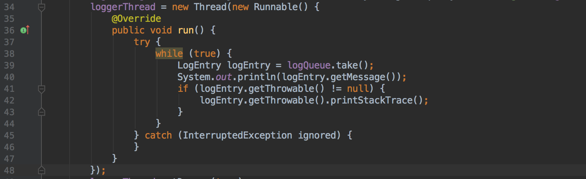

<!-- Título do Respositório -->
# Coffe Shop
<!-- -->

<!-- Badges -->
<p align="center">
    
</p>
<!-- -->

<!-- Msg de boas vindas -->
<p align="center">Bem-vindo ao meu repositório de
<!-- -->

<!-- Logo -->
<p align="center">
    
</p>
<!-- -->

<!-- Links Principais-->
<p align="center">
    <a href="https://docs.oracle.com/javase/8/docs/" target="_blank"><strong>Documentação da linguagem »</strong></a>
    <br/>
    <a href="https://pt.wikipedia.org/wiki/Java_(linguagem_de_programa%C3%A7%C3%A3o)" target="_blank"><strong>Página no Wikipedia »</strong></a>
    <br/>
    <a href="https://www.java.com/pt_BR/" target="_blank"><strong>Site Oficial »</strong></a>
    <br/>
</p>
<!-- -->

<!-- Links do Repositório -->
<p align="center">
    <a href="Exercícios Resolvidos">Exercícios Resolvidos</a>
    ·
    <a href="Programas Simples">Programas Simples</a>
    ·
    <a href="Projetos">Projetos</a>
</p>
<!-- -->

<!-- Language Preview-->
<p align="center">
    
</p>
<!-- -->

---

<!-- Table of Contents -->
## Glossário
- [Coffe Shop](#coffe-shop)
  - [Glossário](#gloss%c3%a1rio)
  - [Objetivo](#objetivo)
  - [Material Utilizado](#material-utilizado)
    - [Sistema Operacional](#sistema-operacional)
    - [Compilador](#compilador)
    - [IDE](#ide)
  - [Programando em Java](#programando-em-java)
    - [Pré-Requisitos](#pr%c3%a9-requisitos)
    - [Executando .java pelo CMD](#executando-java-pelo-cmd)
    - [Criando e Rodando Projetos com Maven](#criando-e-rodando-projetos-com-maven)
    - [Criando Bateria de Testes com intelliJ](#criando-bateria-de-testes-com-intellij)
    - [Exemplo de Hello World](#exemplo-de-hello-world)
  - [Links Úteis](#links-%c3%9ateis)
  - [Autor](#autor)
  - [Licença](#licen%c3%a7a)
<!-- -->

<!-- Objetivo -->
## Objetivo
Este repositório foi criado com a finalidade de guardar meus projetos, ideias, anotações, exercícios e programas pessoais feitos em <strong>Java</strong>.
<!-- -->

<!-- Material Utilizado -->
## Material Utilizado
Estes são os materiais usados por mim para desenvolver e rodar meus programas em Java.
### Sistema Operacional
- [Windows 10](https://www.microsoft.com/pt-br/windows/)
### Compilador
- [Java Runtime Environment](#Links-%C3%9Ateis)
### IDE
- [Visual Studio Code](https://code.visualstudio.com/)
  - Com as extensões: <br/>
    [Maven for Java](https://marketplace.visualstudio.com/items?itemName=vscjava.vscode-maven) <br/>
    [Debugger for Java](https://marketplace.visualstudio.com/items?itemName=vscjava.vscode-java-debug) <br/>
    [Language Support for Java(TM)](https://marketplace.visualstudio.com/items?itemName=redhat.java) <br/>
    [Java Test Runner](https://marketplace.visualstudio.com/items?itemName=vscjava.vscode-java-test) <br/>
    [Java Extension Pack](https://marketplace.visualstudio.com/items?itemName=vscjava.vscode-java-pack) <br/>
    [Java Dependency Viewer](https://marketplace.visualstudio.com/items?itemName=vscjava.vscode-java-dependency)
- [IntelliJ IDEA by JetBrains](https://www.jetbrains.com/idea/)
- [Android Studio](https://developer.android.com/studio)
<!-- -->

<!-- Programando em ... -->
## Programando em Java
O que foi necessário para criar e rodar meus programas em Java

### Pré-Requisitos
Para executar e criar programas em **Java** é necessário ter o compilador do Java (JRE) instalado no computador.

- Para verificar se o java está instalado no PC, basta executar o comando no CMD: <br/>
    `> java --version`
> - Se o comando não for reconhecido, **não está** instalado! *(ver [Links Úteis](#Links-%C3%9Ateis) para instalar o Java e suas dependências)* <br/>
> - Caso exiba a versão do java, **está** instalado! <br/>

### Executando .java pelo CMD
Criando e executando um programa simples em Java pelo CMD

1. Para executar arquivos *.java* pelo terminal deve-se ter o Java JDK (Java Development Kit) devidamente instalado no PC. <br/>
   Para instalar, visitar o site oficial e seguir as intruções.  *(ver [Links Úteis](#Links-%C3%9Ateis))*

2. Após ter baixado e configurado o compilador, já será capaz de criar e executar programas Java no Windows.

- Para compilar programas *".java"* e executá-los no terminal/cmd:
  - Abrir pasta onde se localiza o arquivo main (principal) *.java*: <br/>
     `> cd "pasta do programa"`
  - Compilar o programa: <br/>
     `> javac "nome do programa".java`
  - Para executar: <br/>
     `> java "nome do programa"`
  
  - Exemplo: <br/>
     `> cd "C:\Users\Guilherme\Documentos\Meus Programas\Java\Programa Hello World\main" // Para ir até a pasta do arquivo main .java` <br/>
     `> javac HelloWorld.java // Para compilar o programa"` <br/>
     `> java HelloWorld // Para executar este programa`

### Criando e Rodando Projetos com Maven

1. Criar a arquitetura de diretórias usando Maven CLI: <br/>
   `> mvn archetype:generate -DgroupId="nome do package" -DartifactId="nome do app"² -DarchetypeArtifactId=maven-archetype-quickstart -DarchetypeVersion=1.4 -DinteractiveMode=false` <br/>
    - **"nome do package"** - Aqui fica o nome do diretório dos arquivos .java do projeto. (Exemplo: `br.com.br`)
    - **"nome do app"** - Aqui fica o nome da classe principal (main) e também da pasta principal do projeto (onde ficará o arquivo main). (Exemplo: *Conta*)
    - Exemplo de arquitetura de diretórios: <br/>
    `C:\Users\Guilherme\"nome do app"\src\main\java\"nome do package"\"nome do app".java` <- Classes principais <br/>
    `C:\Users\Guilherme\"nome do app"\src\test\java\"nome do package"\ContaTeste.java` <- Classes de Testes (Bateria de Testes)

2. Renomear arquivos App e AppTest para os nomes desejados usando Refactor / Do Refactor *(no intelliJ IDEA IDE)*
   
3. Alterar o *pom.xml*
   1. Trocar a versão: <br/>
        de: <br/>
        ```
        <maven.compiler.source>1.7</maven.compiler.source>
        <maven.compiler.target>1.7</maven.compiler.target>
        ```
        para: <br/>
        ```
        <maven.compiler.source>1.8</maven.compiler.source>
        <maven.compiler.target>1.8</maven.compiler.target>
        ```
    1. Adicionar o plugin gerador de jar do maven para poder compilar: <br/>
        Para isso, alterar as linhas 51 à 54 <br/>
        de: <br/>
        ```
        <plugin>
            <artifactId>maven-jar-plugin</artifactId>
            <version>3.0.2</version>
        </plugin>
        ```
        para: <br/>
        ```
        <plugin>
            <groupId>org.apache.maven.plugins</groupId>
            <artifactId>maven-jar-plugin</artifactId>
            <version>3.0.2</version>
            <configuration>
                <archive>
                    <manifest>
                        <addClasspath>true</addClasspath>
                        <mainClass>br.com.bb.MainClass</mainClass>
                    </manifest>
                </archive>
            </configuration>
        </plugin>
        ```
        Onde "**br.com.bb.MainClass**" é o caminho (separado por .) da pasta onde se localiza o arquivo principal (main) do programa.

4. Para compilar o programa:
   - Usando plugin/extensão do Maven no intelliJ: <br/> Maven -> Compile
   - ou usando o terminal: <br/> `> mvn compile`
5. Para gerar o *.jar*:
   - Usando plugin/extensão do Maven no intelliJ: <br/> Maven -> Package
   - ou usando o terminal: <br/> `> mvn package`
6. Forma mais fácil e rápida para compilar e gerar o jar de uma só vez usando o terminal:
   - `> mvn compile package`
7. Para rodar o programa, executar o jar gerado na pasta *target*:
   - `> java -jar target/"app"-1.0-SNAPSHOT.jar` <br/>
    Onde **"app"** é o nome do arquivo/classe principal do programa.

### Criando Bateria de Testes com intelliJ

1. Criar os métodos vazios apenas definindo os parâmetros
2. Criar a bateria de testes no **"AppTest"** *(renomear)* (localizado na pasta test) de determinado método:
   - Code -> Generate... -> Test... <br/>
     ou <br/>
   - Botão direito -> Generate... -> Test...
3. Ir rodando testes primeiro, alterando e modificando os métodos depois.

### Exemplo de Hello World
``` Java
public class HelloWorld {

    public static void main(String[] args) {
        String mensagem1 = new HelloWorld().retornaMsg1();
        String mensagem2 = new HelloWorld().retornaMsg2();
        System.out.println(mensagem1 + mensagem2 + "=)");
    }

    public String retornaMsg1() {
        return "Hello, ";
    }

    public String retornaMsg2() {
        return "Gui! ";
    }

}
```

Saída: <br/>
`> Hello, Gui! =)`
<!-- -->

<!-- Links-->
## Links Úteis
- [Java™ SE (Standard Edition) Development Kit (JDK™) - Java JDK](https://www.oracle.com/technetwork/pt/java/javase/downloads/jdk8-downloads-2133151.html)
- [Java Download](https://www.java.com/pt_BR/download/)
- [Visual Paradigm - Criação de Diagramas UML online](online.visual-paradigm.com/)
<!-- -->

<!-- Autor/Contato -->
## Autor
* **Guilherme Esdras (guilherme.esdras@outlook.com)** - [GitHub Page](https://github.com/GuilhermeEsdras)
<!-- -->

<!-- Licença -->
## Licença
*Distributed under the MIT License. See LICENSE for more information.*